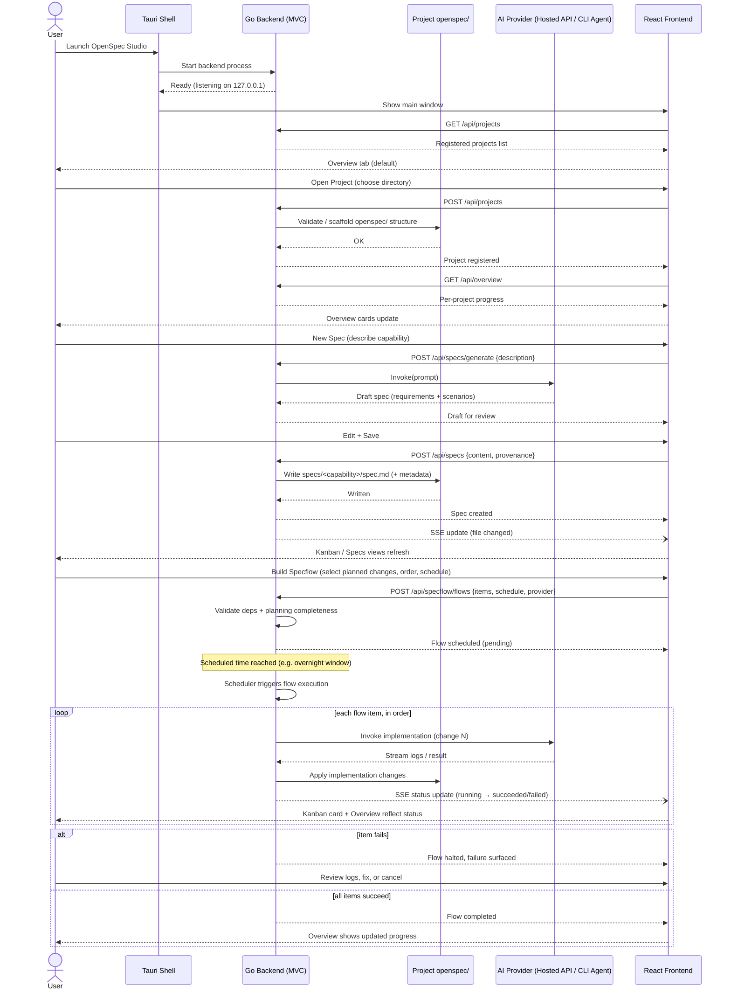

# OpenSpec Studio — End-to-End Sequence

Covers the full lifecycle the six planned changes implement: opening a project,
authoring a spec, scheduling it in Specflow, and unattended implementation via
a configured AI provider, with real-time updates pushed over SSE.

